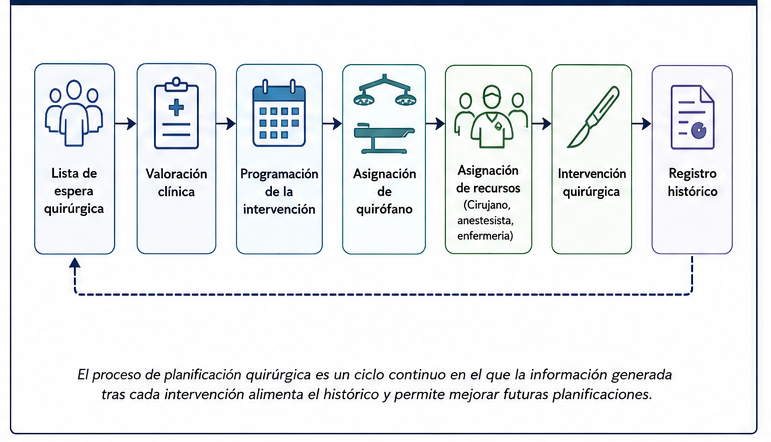
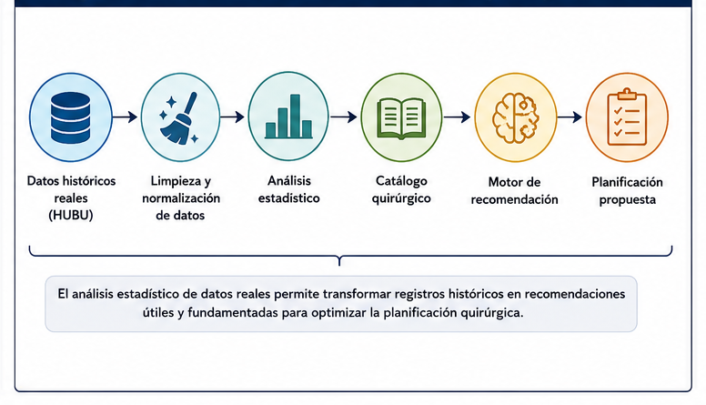
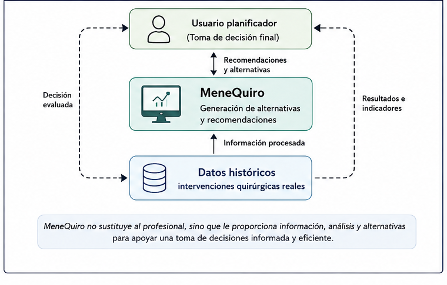

```{=latex}
%% ── Capítulo 3: Marco teórico ───────────────────────────────
\capitulo{3}{Conceptos teóricos}
```

Este capítulo presenta los fundamentos teóricos necesarios para comprender el desarrollo de MeneQuiro. El trabajo se sitúa en la intersección entre la gestión hospitalaria, el análisis estadístico de datos reales, la planificación de recursos quirúrgicos y los sistemas de apoyo a la decisión. Por ello, antes de describir la metodología seguida, resulta necesario contextualizar el problema desde una perspectiva clínica, organizativa y técnica.

## Organización del bloque quirúrgico

El bloque quirúrgico constituye una de las unidades asistenciales más complejas de un hospital, tanto por el volumen de recursos que concentra como por el impacto que tiene sobre la actividad global del centro. En él convergen recursos humanos altamente especializados, equipamiento técnico, salas de quirófano, camas de recuperación, material quirúrgico, anestesia, tiempos de preparación y procedimientos administrativos.

Desde el punto de vista de la Ingeniería de la Salud, el bloque quirúrgico puede entenderse como un sistema dinámico sujeto a restricciones, incertidumbre y variabilidad. Cada intervención requiere una combinación específica de recursos y presenta una duración difícil de predecir con exactitud, ya que depende de factores como el tipo de procedimiento, la complejidad clínica del paciente, el equipo quirúrgico, la técnica empleada y las posibles incidencias intraoperatorias.

La planificación quirúrgica tiene como objetivo asignar intervenciones a quirófanos y franjas horarias disponibles, intentando maximizar la utilización de los recursos y reducir los tiempos improductivos. Esta tarea se complica por la existencia de urgencias, cancelaciones, retrasos, variabilidad en la duración de las cirugías y restricciones de disponibilidad del personal. Por ello, la literatura científica considera la programación de quirófanos como un problema clásico de planificación y optimización dentro de la gestión sanitaria [@cardoen2010; @alamin2025]. 

La arquitectura general del sistema desarrollado se muestra en la @fig-figura31, donde se representan los principales módulos funcionales de MeneQuiro y el flujo de información entre ellos.

{#fig-figura31 width=95%}

## Planificación quirúrgica y niveles de decisión

La planificación quirúrgica puede analizarse en diferentes niveles temporales y organizativos:

- **Planificación estratégica**, relacionada con la asignación global de recursos, número de quirófanos disponibles, distribución por servicios y capacidad quirúrgica del hospital.
- **Planificación táctica**, centrada en la organización de bloques horarios, distribución semanal o mensual de actividad y asignación de tiempos quirúrgicos por especialidad.
- **Planificación operativa**, correspondiente a la programación diaria de intervenciones concretas, asignación de pacientes, equipos quirúrgicos, anestesistas y salas.

El presente trabajo se centra principalmente en la planificación operativa, ya que MeneQuiro asiste al planificador en la asignación de nuevas intervenciones dentro de una agenda diaria existente. Sin embargo, los indicadores generados por la herramienta, como la duración media de procedimientos, la ocupación por quirófano o la variabilidad de las intervenciones, también pueden aportar información útil para niveles tácticos de decisión.

La planificación quirúrgica no debe interpretarse únicamente como un problema de ocupación de salas, sino como un proceso de toma de decisiones en el que se combinan criterios clínicos, organizativos y temporales. Por este motivo, una herramienta de apoyo debe permitir que el usuario mantenga siempre la decisión final, actuando como un sistema de ayuda y no como un sustituto del criterio profesional.

El flujo general del proceso de planificación quirúrgica se representa en la @fig-figura32, mostrando las diferentes etapas necesarias para la programación y ejecución de una intervención quirúrgica.

{#fig-figura32 width=95%}

## Importancia del análisis estadístico de datos reales

Uno de los elementos diferenciales de este Trabajo Fin de Grado es el uso de datos históricos reales procedentes de la actividad quirúrgica. El sistema desarrollado no se basa en datos simulados ni en ejemplos artificiales, sino en registros generados durante la práctica asistencial real. Esto aporta un valor añadido importante, ya que permite caracterizar el comportamiento de los procedimientos quirúrgicos a partir de la experiencia acumulada del propio hospital.

El análisis estadístico de estos datos permite transformar registros administrativos e históricos en información útil para la planificación. Entre las variables más relevantes se encuentran la fecha de intervención, el quirófano utilizado, la hora de inicio, la hora de finalización, la duración, el procedimiento realizado, el equipo quirúrgico, el tipo de intervención y el estado final de la cirugía.

A partir de estas variables es posible calcular indicadores como:

- número total de intervenciones;
- duración media y mediana de cada procedimiento;
- variabilidad de duración;
- utilización de cada quirófano;
- distribución temporal de la actividad;
- tiempos muertos entre intervenciones consecutivas;
- frecuencia de procedimientos;
- porcentaje de urgencias o cancelaciones.

La duración quirúrgica es una variable especialmente relevante. En la práctica, dos intervenciones con el mismo nombre pueden presentar duraciones diferentes debido a la variabilidad clínica y organizativa. Por ello, el uso de medidas estadísticas como la media, la mediana y la desviación típica permite representar mejor el comportamiento real de cada procedimiento que una estimación fija introducida manualmente.

En MeneQuiro, el estudio estadístico de los datos reales constituye la base del catálogo quirúrgico. Este catálogo no es una simple lista de procedimientos, sino una estructura derivada del histórico que resume el comportamiento observado de cada tipo de intervención. De este modo, la herramienta puede estimar la duración planificable de una nueva cirugía a partir de información empírica procedente de intervenciones realizadas previamente.

El funcionamiento del algoritmo de recomendación automática de huecos quirúrgicos basado en datos históricos reales se resume en la @fig-figura33, donde se ilustra el proceso seguido para generar propuestas de planificación compatibles con la agenda existente.

{#fig-figura33 width=95%}

## Sistemas de apoyo a la decisión

Los sistemas de apoyo a la decisión clínica, conocidos como CDSS por sus siglas en inglés, son herramientas diseñadas para proporcionar información, recomendaciones o alertas que ayuden a los profesionales sanitarios durante un proceso de toma de decisiones [@sutton2020]. En un sentido amplio, estos sistemas no reemplazan al profesional, sino que organizan, procesan y presentan información relevante para facilitar una decisión más informada.

En el contexto de este proyecto, MeneQuiro puede considerarse un sistema de apoyo a la decisión aplicado a la planificación quirúrgica. Su objetivo no es decidir de forma autónoma qué cirugía debe realizarse, sino proporcionar al planificador una serie de alternativas razonadas a partir de los datos históricos y de la agenda existente. El usuario puede revisar las propuestas, valorar su conveniencia y seleccionar la opción que considere más adecuada.

La principal diferencia entre una herramienta de visualización convencional y un sistema de apoyo a la decisión reside en la capacidad de transformar datos en recomendaciones. Mientras que una agenda digital muestra la planificación existente, MeneQuiro analiza dicha planificación, identifica huecos compatibles y ordena las alternativas en función de criterios como duración disponible, holgura y quirófano habitual.

## Recomendación de huecos quirúrgicos

La recomendación de huecos quirúrgicos constituye uno de los elementos principales de MeneQuiro. A partir del análisis del histórico de intervenciones y de la agenda existente para una fecha determinada, el sistema identifica aquellas franjas horarias compatibles con la duración estimada del procedimiento. El objetivo no consiste en obtener una solución óptima desde un punto de vista matemático, sino en proporcionar al planificador diferentes alternativas viables que faciliten la toma de decisiones durante la programación quirúrgica.

El problema abordado puede entenderse como una tarea de programación de intervenciones en recursos limitados, donde cada cirugía ocupa un quirófano durante un intervalo temporal concreto. Este tipo de problemas ha sido ampliamente estudiado en la literatura sobre planificación de quirófanos y gestión del bloque quirúrgico [@cardoen2010; @guerriero2011; @alamin2025].

En MeneQuiro, el algoritmo implementado sigue un enfoque basado en reglas y en el análisis del histórico quirúrgico. Esta aproximación resulta adecuada para un prototipo funcional, ya que permite generar recomendaciones comprensibles, interpretables y reproducibles. Las propuestas no sustituyen el criterio del planificador, sino que actúan como apoyo durante el proceso de decisión.

Las alternativas generadas se ordenan considerando criterios como:

- suficiencia del hueco disponible;
- holgura temporal restante;
- quirófano habitual del procedimiento;
- hora de inicio;
- ausencia de solapamientos.

Este enfoque permite mantener un equilibrio entre utilidad práctica e interpretabilidad, aspecto especialmente importante en sistemas de apoyo a la decisión aplicados a entornos sanitarios [@sutton2020; @berner2007].

## Indicadores de eficiencia quirúrgica

Para valorar la planificación de quirófanos es necesario definir indicadores que permitan analizar la utilización de los recursos. Entre los indicadores más empleados se encuentran la ocupación del quirófano, el número de intervenciones realizadas, la duración media de los procedimientos, los tiempos muertos entre cirugías y la variabilidad de las duraciones [@cardoen2010; @guerriero2011].

En MeneQuiro se presta especial atención a los tiempos muertos, entendidos como los intervalos disponibles entre el final de una intervención y el inicio de la siguiente dentro de un mismo quirófano. Estos intervalos no siempre pueden eliminarse completamente, ya que pueden responder a necesidades de limpieza, preparación, traslado o reorganización del equipo. Sin embargo, su análisis permite detectar patrones de ineficiencia y valorar si existen oportunidades de mejora en la planificación.

También resulta relevante estudiar la variabilidad de los procedimientos. Un procedimiento con duración media moderada pero alta dispersión puede ser más difícil de planificar que otro más largo pero estable. Por este motivo, el sistema no solo considera la duración media, sino también la distribución histórica de las duraciones como elemento de análisis. El uso de estadística descriptiva para caracterizar conjuntos de datos constituye una herramienta fundamental en procesos de análisis aplicados [@james2021; @hastie2009].

## Tratamiento de datos hospitalarios

El uso de datos procedentes de un entorno hospitalario requiere una fase previa de limpieza, depuración y normalización. En la práctica, los datos históricos pueden contener valores ausentes, nombres de procedimientos escritos de forma diferente, abreviaturas, errores ortográficos, registros incompletos o formatos heterogéneos de fecha y hora.

En este proyecto, el preprocesamiento de datos ha sido una fase fundamental, ya que la calidad de las recomendaciones depende directamente de la calidad del histórico utilizado. Entre las tareas realizadas se incluyen:

- conversión de fechas y horas a formatos temporales consistentes;
- cálculo de la duración real de cada intervención;
- eliminación o tratamiento de registros incompletos;
- normalización de nombres de procedimientos;
- agrupación de variantes equivalentes;
- identificación de cirugías urgentes, suspendidas o planificadas;
- preparación de variables derivadas para el análisis estadístico.

Durante el proceso de depuración se detectaron múltiples variantes ortográficas, abreviaturas y errores tipográficos que impedían realizar un análisis estadístico consistente. La normalización permitió agrupar procedimientos equivalentes bajo una única denominación, reduciendo la dispersión artificial del catálogo quirúrgico.

La @tbl-normalizacion-procedimientos muestra algunos ejemplos representativos del proceso de normalización aplicado.

| Valor original | Valor normalizado |
|---|---|
| `COLECISTECTOMIA LAPAROSCOPICA.` | Colecistectomía laparoscópica |
| `COLECISTETOMIA LAPAROSCOPICA` | Colecistectomía laparoscópica |
| `COLECISTESCTOMIA LAPAOSCOPICA` | Colecistectomía laparoscópica |
| `APENDICECTOMIA LPS` | Apendicectomía laparoscópica |
| `APENDICECTOMIA LAPAROSCOPICA.` | Apendicectomía laparoscópica |
| `HEMORROIDECTOMIA.` | Hemorroidectomía |

: Ejemplos de normalización de procedimientos quirúrgicos {#tbl-normalizacion-procedimientos}

Esta fase resulta especialmente importante porque los datos hospitalarios reales no suelen estar diseñados inicialmente para alimentar sistemas de recomendación, sino para registrar actividad asistencial. Por ello, uno de los retos principales del proyecto ha consistido en convertir un conjunto de datos operativo en una base analítica estructurada.

## Tecnologías empleadas

El desarrollo de MeneQuiro se ha realizado utilizando un conjunto de tecnologías seleccionadas por su adecuación al análisis de datos, la creación de prototipos funcionales y la generación de visualizaciones interactivas.

Python se ha utilizado como lenguaje principal debido a su amplio ecosistema de bibliotecas científicas y su flexibilidad para el procesamiento de datos [@python2026]. Pandas y NumPy han permitido realizar la limpieza, transformación y análisis estadístico del histórico quirúrgico [@pandas2026; @numpy2026]. Plotly se ha empleado para generar visualizaciones interactivas, especialmente en la representación de agendas, gráficos de ocupación y análisis de procedimientos [@plotly2026].

SQLite se ha utilizado como sistema de persistencia local para almacenar las intervenciones planificadas y realizadas durante el uso de la herramienta. Esta elección resulta adecuada para un prototipo académico por su sencillez, portabilidad y facilidad de integración [@sqlite2026]. No obstante, en un escenario hospitalario real sería recomendable migrar a una base de datos centralizada, como PostgreSQL o SQL Server, para permitir sincronización, concurrencia y acceso multiusuario.

Streamlit se ha empleado como framework de interfaz por su capacidad para convertir scripts de análisis de datos en aplicaciones interactivas de forma rápida y mantenible [@streamlit2026]. Esta elección ha permitido centrar el desarrollo en la lógica de planificación, el análisis estadístico y la visualización de resultados, manteniendo una interfaz accesible para usuarios no técnicos.


{#fig-figura34 width=95%}

## Estado del arte y trabajos relacionados

La planificación de quirófanos ha sido ampliamente estudiada desde el ámbito de la investigación operativa y la gestión sanitaria. Cardoen et al. realizan una revisión de la literatura sobre planificación y programación de quirófanos, destacando la diversidad de enfoques existentes en función del nivel de decisión, las restricciones consideradas, los objetivos de planificación y la incorporación de incertidumbre [@cardoen2010].

Revisiones posteriores continúan señalando la complejidad del problema y la importancia de considerar restricciones reales del entorno hospitalario, como la disponibilidad de personal, la variabilidad de duración de los procedimientos y las limitaciones de recursos [@guerriero2011; @alamin2025]. Estos trabajos evidencian que la planificación quirúrgica no puede abordarse únicamente como un problema teórico, sino que requiere soluciones adaptadas al contexto operativo del hospital.

Por otra parte, los sistemas de apoyo a la decisión han adquirido una importancia creciente en el ámbito sanitario. Sutton et al. describen los CDSS como herramientas destinadas a mejorar la atención sanitaria mediante la integración de conocimiento clínico e información específica del paciente o del proceso asistencial [@sutton2020]. En esta línea, MeneQuiro aplica el concepto de apoyo a la decisión a la planificación quirúrgica, utilizando datos históricos para generar recomendaciones operativas.

En el ámbito académico también existen trabajos orientados al desarrollo de herramientas de apoyo a la planificación quirúrgica. Entre ellos destaca el Trabajo Fin de Grado desarrollado por García González [@garcia2025], en el que se plantea una aplicación destinada a la gestión de quirófanos desde una perspectiva organizativa. Aunque comparte el objetivo de mejorar la planificación quirúrgica, MeneQuiro incorpora como elemento diferenciador la construcción de un catálogo estadístico de procedimientos y un algoritmo propio de recomendación de huecos basado en el análisis del histórico de intervenciones.

En el ámbito comercial existen igualmente soluciones especializadas para la gestión integral del bloque quirúrgico, como Torin OR Management de Getinge [@torin2025], que integra funciones de planificación, seguimiento de la actividad, gestión de recursos y análisis de indicadores. Sin embargo, este tipo de plataformas están orientadas a implantaciones hospitalarias de mayor escala, mientras que MeneQuiro se plantea como una herramienta ligera, adaptable y centrada en la explotación del histórico quirúrgico para asistir al proceso de planificación.

La @tbl-comparativa-sistemas resume de forma conceptual la diferencia entre el trabajo desarrollado y otras soluciones académicas o comerciales consultadas durante el proyecto.

| Funcionalidad | Torin OR Management | TFG Univ. Valladolid | MeneQuiro |
|---|:---:|:---:|:---:|
| Gestión de agenda quirúrgica | Sí | Sí | Sí |
| Visualización de planificación | Sí | Sí | Sí |
| Análisis estadístico del histórico | Sí | Limitado | Sí |
| Catálogo estadístico de procedimientos | No especificado | No | Sí |
| Estimación automática de duración | Sí | No especificado | Sí |
| Recomendación de huecos quirúrgicos | Sí | Limitado | Sí |
| Simulación de nuevas intervenciones | Sí | Limitado | Sí |
| Exportación de resultados | Sí | Sí | Sí |
| Planificación de guardias | No especificado | No | Sí |

: Comparación conceptual entre MeneQuiro y soluciones relacionadas {#tbl-comparativa-sistemas}

La comparación anterior no pretende establecer una evaluación objetiva del rendimiento de las herramientas existentes, sino situar las principales funcionalidades desarrolladas en MeneQuiro respecto a otras soluciones académicas y comerciales consultadas durante el proyecto. De este modo, el presente trabajo no busca sustituir sistemas hospitalarios de gran escala, sino demostrar la viabilidad de una capa de apoyo a la decisión construida sobre datos históricos, capaz de aportar valor añadido mediante análisis estadístico, visualización y recomendación automática.