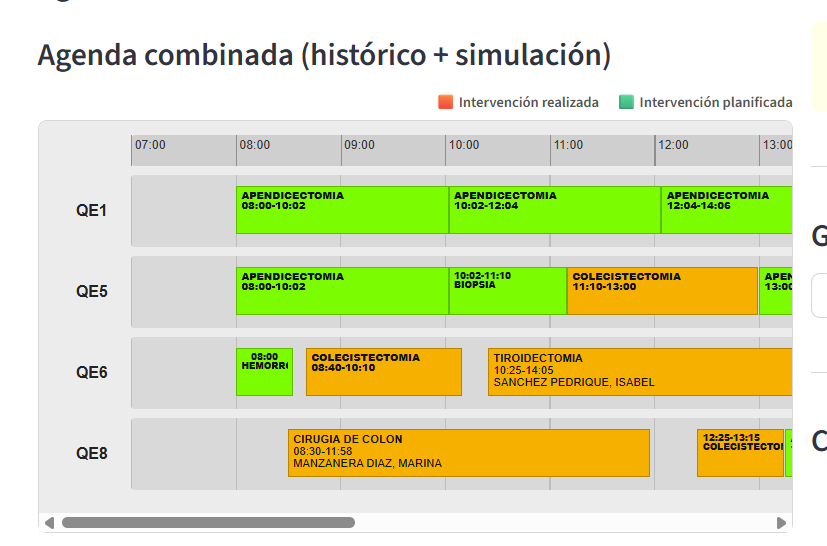

```{=latex}
%% ══════════════════════════════════════════════════════
%%  APÉNDICE G – Resultados experimentales
%% ══════════════════════════════════════════════════════
\apendice{Estudio experimental}
```

## Cuaderno de trabajo

El desarrollo de MeneQuiro se llevó a cabo de forma incremental, incorporando nuevas funcionalidades conforme se identificaban necesidades durante las prácticas realizadas en el Hospital Universitario de Burgos. Cada modificación fue validada antes de incorporarse a la versión principal del proyecto, manteniendo el código bajo control de versiones mediante Git [@git2025].

Los principales experimentos realizados durante el desarrollo fueron:

- limpieza y normalización del histórico quirúrgico;
- cálculo automático de la duración de las intervenciones;
- construcción del catálogo estadístico de procedimientos;
- desarrollo de diferentes estrategias para estimar la duración planificable;
- implementación del algoritmo de búsqueda de huecos;
- incorporación de comprobaciones de solapamiento;
- desarrollo de la agenda visual interactiva;
- integración de una base de datos SQLite para almacenar planificaciones;
- exportación de resultados a Excel, CSV y PDF;
- desarrollo del planificador automático de guardias.

Durante el proceso también se descartaron distintas aproximaciones que no ofrecían resultados satisfactorios. Entre ellas destacan la utilización exclusiva de la duración media como estimación de los procedimientos, que producía recomendaciones poco robustas en procedimientos con elevada variabilidad, y versiones iniciales del algoritmo que no contemplaban las intervenciones simuladas ya incorporadas durante una sesión de planificación, lo que podía generar propuestas incompatibles.

La versión final incorpora una estimación basada en la mediana histórica, un margen asociado a la variabilidad observada y la comprobación de solapamientos antes de aceptar cualquier nueva planificación.

## Configuración y parametrización de las técnicas

El algoritmo desarrollado emplea una serie de parámetros definidos durante el proceso experimental con el objetivo de obtener recomendaciones coherentes con el funcionamiento observado en el bloque quirúrgico.

La @tbl-parametros resume los principales parámetros utilizados.

| Parámetro | Valor |
|-----------|------:|
| Tiempo de preparación | 15 min |
| Tiempo posterior a la intervención | 10 min |
| Buffer de variabilidad | 50 % de la desviación típica |
| Horario del bloque quirúrgico | 08:00–20:00 |
| Agenda utilizada | Histórica + simulaciones |
| Ordenación de propuestas | Quirófano habitual → menor holgura → inicio más temprano |

: Parámetros utilizados por el algoritmo de recomendación. {#tbl-parametros}

La estimación de la duración planificable se diseñó para obtener una aproximación conservadora sin sobredimensionar innecesariamente la duración de las intervenciones. Para ello se empleó la mediana histórica como estimador principal, complementada con tiempos operativos fijos y un margen proporcional a la desviación típica observada, siguiendo recomendaciones habituales para el análisis de datos con variabilidad y valores extremos [@james2021; @montgomery2020].

La ordenación de las recomendaciones prioriza los quirófanos donde históricamente se realiza con mayor frecuencia cada procedimiento. Cuando existen varias alternativas equivalentes, se favorecen aquellas con menor holgura disponible para mejorar el aprovechamiento de la agenda.

## Detalle de resultados

La validación funcional confirmó el correcto comportamiento de todos los módulos principales desarrollados.

Las pruebas realizadas permitieron verificar:

- construcción automática del catálogo quirúrgico;
- estimación de la duración planificable;
- identificación correcta de huecos disponibles;
- detección automática de solapamientos;
- actualización dinámica de la agenda tras incorporar nuevas cirugías;
- persistencia de planificaciones y cirugías realizadas;
- exportación correcta de los resultados en distintos formatos;
- funcionamiento del planificador automático de guardias.

Durante las pruebas no se detectaron inconsistencias en la generación de recomendaciones una vez incorporadas las comprobaciones de solapamiento y la integración de las intervenciones simuladas dentro de la agenda diaria.

La Figura \ref{fig:agenda-exp} muestra un ejemplo representativo del funcionamiento final de la aplicación durante una sesión de planificación.

{#fig-agenda-exp width=95%}

Como resultado del proceso experimental se obtuvo una aplicación funcional capaz de integrar el análisis estadístico del histórico, la generación automática de recomendaciones y la visualización interactiva de la planificación dentro de un único entorno de trabajo. Aunque el sistema constituye un prototipo académico, las pruebas realizadas muestran la viabilidad técnica del enfoque propuesto para apoyar la planificación quirúrgica utilizando datos históricos reales.